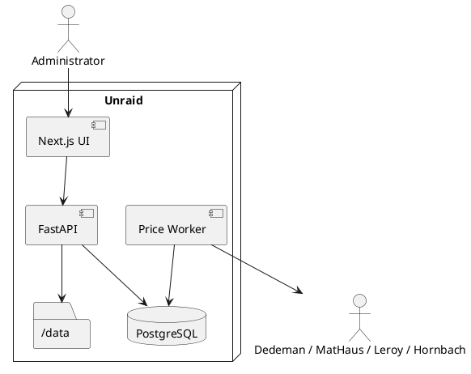

# SPEC-001-Deviz-Construcții

## Background

Aplicație locală pentru estimare costuri de construcție, devize și Bill of Quantities (BOQ),
cu prețuri de la Dedeman, MatHaus, Leroy Merlin, Hornbach și furnizori locali.
Locația implicită de livrare este Ceahlău, Neamț. Aplicația rulează pe Unraid,
este accesată prin IP LAN și prin VPN-ul existent.

## Requirements

### Must
- UI și documente în limba română.
- RON, prețuri cu TVA; TVA configurabil, implicit 21%.
- Proiect → Corp → Nivel → Capitol → Lucrare → Resurse.
- BOQ manual și calcul automat din geometrie.
- Rețete standard, personalizate și override la proiect.
- Materiale, manoperă, utilaje, transport, alte costuri.
- Încăperi, fundații, plăci, grinzi, stâlpi, acoperiș, armături, etrieri, plasă sudată.
- Furnizori online și locali, oferte manuale, stații beton.
- Cost livrat la Ceahlău.
- Moduri: furnizor preferat, furnizor unic minim, mix minim.
- Istoric prețuri și snapshot de deviz.
- PDF și XLSX.
- Comenzi, recepții, retururi, facturi, stoc și cost real.
- Manoperă reală și progres fizic.
- Calendar, dependențe, blocaje și necesar 7/14/30 zile.
- Jurnal șantier, poze și raport săptămânal.
- Export proiect complet și reimport.
- Administrator unic cu parolă și sesiune 7 zile.
- Unraid / Docker; frontend 3080, backend 8030; fără reverse proxy; PostgreSQL neexpus.

### Should
- Matching automat material generic ↔ produse.
- Stare stoc și vechime preț.
- Alternative la produse indisponibile.
- Calcul transport/palet/greutate.

### Could
- Import planuri PDF.
- BIM/Revit.
- Extindere la alți furnizori.

### Won't (MVP)
- Achiziție automată la retaileri.
- Dependență de API-uri private/undocumented.
- Expunere directă la Internet.
- Backup automat zilnic.

## Method

Arhitectură monolit modular + worker separat.

Principiul central: catalogul de materiale și rețetele nu depind de SKU-urile retailerilor.
Produsele retailerilor sunt oferte ce se mapează pe materiale generice.

Costul de comparație este costul livrat:
`Σ(materiale cumpărate) + Σ(transport furnizori utilizați)`.

Devizele emise sunt imuabile; o actualizare de preț creează o versiune nouă.

## Implementation

1. Platformă, DB, autentificare, wizard, CI/GHCR.
2. BOQ + rețete + geometrie.
3. Furnizori, produse, prețuri, matching.
4. Achiziții, recepții, stoc, facturi.
5. Execuție, progres, calendar, jurnal.
6. Exporturi PDF/XLSX/ZIP și rapoarte.
7. Stabilizare v1.0.0.

## Milestones

- M1 platformă executabilă.
- M2 motor BOQ.
- M3 geometrie/structură.
- M4 furnizori și prețuri.
- M5 achiziții.
- M6 cost real.
- M7 planificare/jurnal.
- M8 documente/raportare.
- M9 hardening + release.

## Gathering Results

Criterii de acceptanță:
- un proiect poate merge de la dimensiuni la cantități și deviz;
- calculele financiare și cantitative au teste automate;
- prețurile vechi nu modifică devize emise;
- retailer indisponibil nu blochează BOQ;
- upgrade-urile DB se fac numai prin Alembic;
- release-urile se construiesc automat din tag-uri Git.

## Need Professional Help in Developing Your Architecture?

Please contact me at [sammuti.com](https://sammuti.com) :)
